# Práctica de Estructuras de Datos: Árboles

El objetivo de este repositorio es proporcionarles un entorno práctico donde puedan aplicar los conceptos teóricos vistos en clase relacionados con árboles N-arios, árboles binarios, recorridos y transformaciones.

## Objetivos de Aprendizaje

Al completar estos ejercicios, serán capaces de:
1. Comprender y manipular la estructura básica de nodos con múltiples hijos y nodos binarios.
2. Implementar la lógica de inserción en un Árbol Binario de Búsqueda (BST).
3. Utilizar la recursividad para calcular métricas estructurales, como la profundidad máxima.
4. Extraer datos mediante recorridos estándar (In-Order).
5. Modificar la estructura subyacente de los punteros para transformar un árbol.

## Estructura del Repositorio

El repositorio contiene 5 ejercicios, cada uno debe ser hecho en c++ y java

1. Ejercicio 1: Árboles Básicos (Conteo de nodos en árboles N-arios).
2. Ejercicio 2: Árbol Binario (Inserción en BST).
3. Ejercicio 3: Árbol Binario (Cálculo de profundidad máxima).
4. Ejercicio 4: Recorridos (Implementación de In-Order).
5. Ejercicio 5: Transformación (Inversión o árbol espejo).

## Instrucciones para el Desarrollo

1. Dentro de cada archivo encontrarán la estructura básica de las clases (o structs) y la definición de un método específico que deben completar. 
2. Localicen el comentario `TODO: Implementa tu lógica aquí`. Esa es la única sección del código que necesitan modificar.
3. No es necesario modificar el método `main`. Este método ya contiene la construcción de un árbol de prueba y las impresiones necesarias para validar que su algoritmo funciona correctamente.
4. Su objetivo es lograr que, al ejecutar el código, los resultados calculados coincidan con los resultados esperados impresos en la consola.

##  Información General
 
| Campo | Detalle |
|-------|---------|
| **Estudiante** | Sigcha Arcos Justin Israel |
| **Materia** | Estructuras de Datos |
| **Universidad** | Universidad Técnica de Ambato |
| **Semestre** | Tercer Semestre |

 
---
 
##  Descripción
 
Este repositorio contiene la implementación de **5 ejercicios** sobre árboles N-arios y árboles binarios, desarrollados en **C++** y **Java**. Cada ejercicio aborda un concepto fundamental de las estructuras de datos jerárquicas, usando recursividad como estrategia principal.
 
---
 
##  Estructura del Repositorio
 
```
APE3_ARBOLES/
├── cpp/
│   ├── Ejercicio1_Basico.cpp
│   ├── Ejercicio2_Binario.cpp
│   ├── Ejercicio3_Binario.cpp
│   ├── Ejercicio4_Recorridos.cpp
│   └── Ejercicio5_Transformacion.java
│   
├── java/
│   ├── Ejercicio1_Basico.java
│   ├── Ejercicio2_Binario.java
│   ├── Ejercicio2_Binario2.java
│   ├── RecorridoInOrder.java
│   └── Ejercicio5_Transforamcion.java
└── README.md

```
 
---
 
##  Resumen de Ejercicios
 
| # | Tema | Estructura | Técnica | Resultado esperado |
|---|------|------------|---------|-------------------|
| 1 | Conteo de nodos | Árbol N-ario | Recursividad | 6 nodos |
| 2 | Inserción BST | Árbol binario | Recursividad | raíz=10, izq=5, der=15 |
| 3 | Altura máxima | Árbol binario | Recursividad + max | Altura = 3 |
| 4 | Recorrido In-Order | BST | Izq → Nodo → Der | 1 2 3 4 5 6 7 |
| 5 | Árbol espejo | Árbol binario | Swap + recursividad | Izq=3, Der=2 |
 
 
---
 
##  Cómo Clonar y Ejecutar
 
### 1. Clonar el repositorio
 
```bash
git clone https://github.com/jostin-sig/Ape3_Arboles.git
cd Ape3_Arboles
```
 
### 2. Ejecutar en C++
 
```bash
# Ejercicio 1
g++ ejercicio1/Ejercicio1_Basico.cpp -o ejercicio1 && ./ej1
 
# Ejercicio 2
g++ ejercicio2/Ejercicio2_Binario.cpp -o ejercicio2 && ./ej2
 
# Ejercicio 3
g++ ejercicio3/Ejercicio3_Binario2.cpp -o ejercicio3 && ./ej3
 
# Ejercicio 4
g++ ejercicio4/Ejercicio4_Recorridos.cpp -o ejercicio4 && ./ej4
 
# Ejercicio 5
g++ ejercicio5/Ejercicio5_Transformacion.cpp -o ejercicio5 && ./ej5
```
 
### 3. Ejecutar en Java
 
```bash
# Ejercicio 1
javac ejercicio1/Ejercicio1_Basico.java
java -cp ejercicio1 Ejercicio1_Basico
 
# Ejercicio 2
javac ejercicio2/Ejercicio2_Binario.java
java -cp ejercicio2 Ejercicio2_Binario
 
# Ejercicio 3
javac ejercicio3/Ejercicio3_Binario2.java
java -cp ejercicio3 Ejercicio3_Binario2
 
# Ejercicio 4
javac ejercicio4/Ejercicio4_Recorridos.java
java -cp ejercicio4 Ejercicio4_Recorridos
 
# Ejercicio 5
javac ejercicio5/Ejercicio5_Transformacion.java
java -cp ejercicio5 Ejercicio5_Transformacion
```
 
---
 
##  Detalle de cada Ejercicio
 
### Ejercicio 1 — Conteo de Nodos en Árbol N-ario
 
Cuenta recursivamente todos los nodos de un árbol donde cada nodo puede tener N hijos.
 
```
Árbol de prueba:        Resultado:
       1
     / | \              Nodos calculados: 6 
    2  3  4
   / \
  5   6
```
 
**Salida esperada:**
```
--- Prueba Ejercicio 1 ---
Nodos esperados: 6
Nodos calculados: 6
```
Ejecución en C++
```
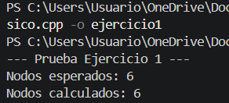
```
Ejecución en Java
```
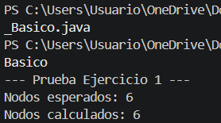
```
 
---
 
### Ejercicio 2 — Inserción en BST
 
Inserta valores en un Árbol Binario de Búsqueda respetando la propiedad de orden.
 
```
Árbol resultante:       Resultado:
      10
     /  \               raíz=10, izq=5, der=15
    5   15              hijo izq del 5 = 3 
   /
  3
```
 
**Salida esperada:**
```
--- Prueba Ejercicio 2 ---
Raiz (Esperado 10): 10
Hijo Izquierdo (Esperado 5): 5
Hijo Derecho (Esperado 15): 15
Hijo Izq del 5 (Esperado 3): 3
```
Ejecución en C++
```
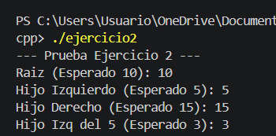
```
Ejecución en Java
```
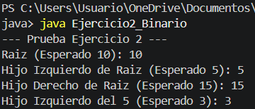
```
 
---
 
### Ejercicio 3 — Altura Máxima del Árbol
 
Calcula la profundidad máxima del árbol de forma recursiva.
 
```
Árbol de prueba:        Resultado:
  1
   \                    Altura = 3 
    2                   (camino: 1 → 2 → 3)
   /
  3
```
 
**Salida esperada:**
```
--- Prueba Ejercicio 3 ---
Altura esperada: 3
Altura calculada: 3
Altura de arbol nulo (esperado 0): 0
```
Ejecución en C++
```
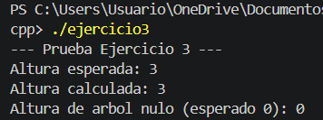
```
Ejecución en Java
```
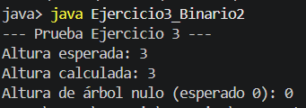
```
 
---
 
### Ejercicio 4 — Recorrido In-Order
 
Recorre el árbol en orden Izquierdo → Nodo → Derecho, produciendo valores ordenados.
 
```
Árbol de prueba:        Resultado:
        4
       / \              1 2 3 4 5 6 7 
      2   6
     / \ / \
    1  3 5  7
```
 
**Salida esperada:**
```
--- Prueba Ejercicio 4 ---
Resultado esperado: 1 2 3 4 5 6 7
Tu resultado:       1 2 3 4 5 6 7
```
Ejecución en C++
```
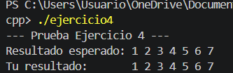
```
Ejecución en Java
```
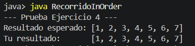
```
 
---
 
### Ejercicio 5 — Árbol Espejo
 
Invierte el árbol binario intercambiando hijos izquierdo y derecho en cada nodo.
 
```
Antes:      Después:
    1           1
  /   \  →    /   \
 2     3      3     2
```
 
**Salida esperada:**
```
--- Prueba Ejercicio 5 ---
Antes de invertir:
Hijo Izq: 2 | Hijo Der: 3
 
Despues de invertir (Esperado: Izq 3 | Der 2):
Hijo Izq: 3 | Hijo Der: 2
```
Ejecución en C++
```
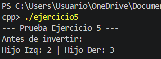
```
Ejecución en Java
```
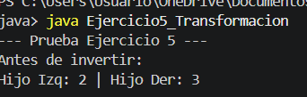
```
 
---
 
##  Historial de Commits
 
```
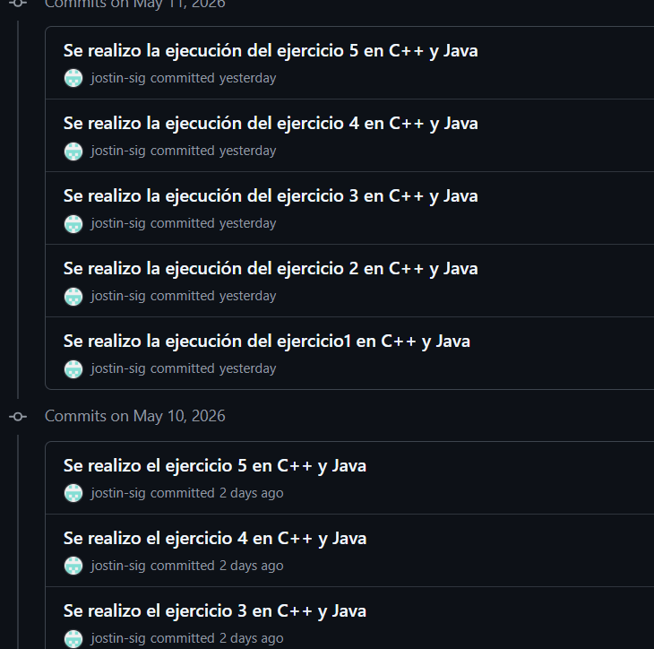
```
 
---
 
##  Conceptos Clave
 
| Concepto | Descripción |
|----------|-------------|
| **Recursividad** | Función que se llama a sí misma con un subproblema más pequeño |
| **Caso base** | Condición que detiene la recursión (nodo nulo → retorna 0 o null) |
| **Árbol N-ario** | Cada nodo puede tener N hijos en una lista |
| **BST** | Menores a la izquierda, mayores a la derecha |
| **In-Order** | Izq → Nodo → Der. Produce valores ordenados en BST |
| **Árbol espejo** | Swap de hijos izq/der en cada nodo recursivamente |
 
---

## Conclusión

El desarrollo de esta práctica permitió comprender y aplicar de forma práctica los conceptos fundamentales sobre árboles como estructuras de datos jerárquicas. A través de los 5 ejercicios implementados en C++ y Java, se pudo evidenciar que la recursividad es la estrategia más natural y eficiente para trabajar con este tipo de estructuras, aprovechando su naturaleza auto-similar para resolver operaciones como el conteo de nodos, la inserción ordenada, el cálculo de altura, los recorridos y la transformación del árbol.

---
 

